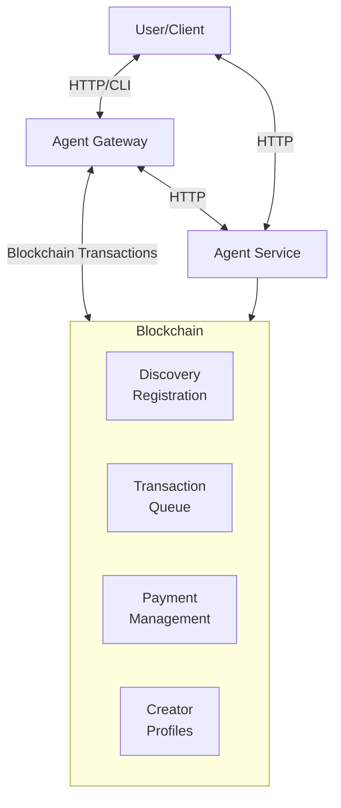

The A3 (Aptos Agent to Agent) Platform is a decentralized system built on the Aptos blockchain for creating, discovering, executing, and managing autonomous agent processes. It combines the power of Move smart contracts with a TypeScript/Node.js SDK and CLI to provide a robust and flexible environment for agent-based applications.

## Key Concepts

- **Agent:** A self-contained unit of computation that can perform specific tasks. Agents have instructions, goals, and roles. Agents can be implemented as services that expose an API endpoint.
- **Process:** A collection of agents and workflows that collaborate to achieve a larger goal. Processes have associated metadata, such as a name, description, owner, tags, and optionally, pricing information.
- **Workflow:** A defined sequence of tasks within a process, specifying the execution order and dependencies between tasks. Workflows define how agents interact to complete a process.
- **Discovery Service:** A decentralized registry of processes, built on the Aptos blockchain. It enables users and systems to find and register processes.
- **Payment Service:** A mechanism for handling payments between users and agents, or between agents themselves. It utilizes an escrow system on the Aptos blockchain to ensure secure and reliable transactions.
- **Transaction Queue:** An on-chain queue that manages transactions submitted to processes. This supports asynchronous execution, prioritization, and transaction tracking.
- **Creator Profile:** A profile associated with process creators, storing information like name, description, wallet address, and social links. This enhances transparency and accountability.
- **Agent Gateway:** The primary entry point for executing agent processes. It handles payment verification, submits transactions to the blockchain, and routes requests to the appropriate agent service.
- **Agent Service:** A service that hosts and executes an agent's logic. It exposes an API endpoint to receive requests and return results.

## Architecture

The A3 platform consists of the following core components:



- **User/Client:** Interacts with the A3 platform via the CLI, SDK, or by directly calling the Agent Gateway's API.
- **Agent Gateway:** Acts as a reverse proxy and intermediary between users and agent services. It handles:
  - Authentication and authorization (currently basic, needs improvement).
  - Payment verification (checking if the user has paid for the process).
  - Submitting transactions to the Aptos blockchain (e.g., registering a transaction in the queue).
  - Routing requests to the appropriate Agent Service.
- **Agent Service:** Runs the actual agent logic. It's a separate service that exposes an HTTP API. This allows agents to be implemented in any language and deployed independently.
- **Aptos Blockchain (Move Contracts):** Provides the decentralized infrastructure for the A3 platform, including:
  - **Discovery Service (`process_registry.move`):** Stores process metadata.
  - **Payment Service (`payment.move`):** Manages payments and escrow.
  - **Transaction Queue (`queue.move`):** Handles asynchronous transaction processing.
  - **Creator Profiles (`creator_profile.move`):** Stores creator information.
  - **A3 Manager (`a3_manager.move`):** Central management of platform configurations.
  - **Workflows (`workflow.move`):** Manages workflows and tasks within processes.

## Getting Started

These steps guide you through setting up the A3 platform and deploying the core contracts.

1. **Prerequisites:**

   - **Node.js and npm:** Ensure you have Node.js (version 18 or later) and npm (or pnpm/yarn) installed.
   - **Aptos CLI:** Install the Aptos CLI by following the instructions on the [Aptos Developer Network](https://aptos.dev/cli-tools/aptos-cli-tool/install-aptos-cli).
   - **Move CLI:** The Aptos CLI includes the Move CLI.
   - **Aptos Account:** You need an Aptos account with some testnet tokens (if deploying to testnet). You can create an account and fund it using the Aptos CLI:

     ```bash
     aptos account create --profile default
     aptos account fund --profile default --amount <amount_in_octas> # e.g., 100000000 for 1 APT
     ```

2. **Clone the Repository:**

   ```bash
   git clone <repository_url> # Replace with the actual repository URL
   cd <repository_name>
   ```

3. **Install Dependencies:**

   ```bash
   pnpm install
   ```

4. **Environment Setup:**

   - Create a `.env` file in the root directory of the project.
   - Add the following environment variables (replace placeholders with your actual values):

     ```
     APTOS_PRIVATE_KEY=<your_aptos_private_key>  # Your Aptos account's private key
     APTOS_NETWORK=testnet                       # Or devnet, mainnet
     APTOS_MODULE_ADDRESS=<your_module_address> # This will be set after contract deployment
     # Optional:
     # APTOS_NODE_URL=<custom_node_url>         # If using a custom Aptos node
     # APTOS_FAUCET_URL=<custom_faucet_url>     # If using a custom faucet
     ```

   - **Security Note:** Never commit your `.env` file to version control. It contains sensitive information (your private key).

5. **Deploy the Smart Contracts:**

   - **Using the Setup Script (Recommended):** The easiest way to deploy the contracts is to use the provided `setup-aptos.sh` script:

     ```bash
     ./setup-aptos.sh
     ```

     This script will:

     1. Generate an Aptos private key (if you don't have one).
     2. Create an Aptos profile.
     3. Derive the account address.
     4. Compile and publish the `process_registry` Move module.
     5. Initialize the registry.
     6. Update your `.env` file with the `APTOS_MODULE_ADDRESS`.
     7. Copy the .env file over to the Move folder

   - **Manual Deployment:** If you prefer manual deployment, refer to the `README.md` file within the `src/discovery/aptos/` directory.

6. **Build the TypeScript Code:**

   ```bash
   pnpm run build
   ```

7. **Run Tests (Optional):**

   ```bash
   pnpm test
   ```
